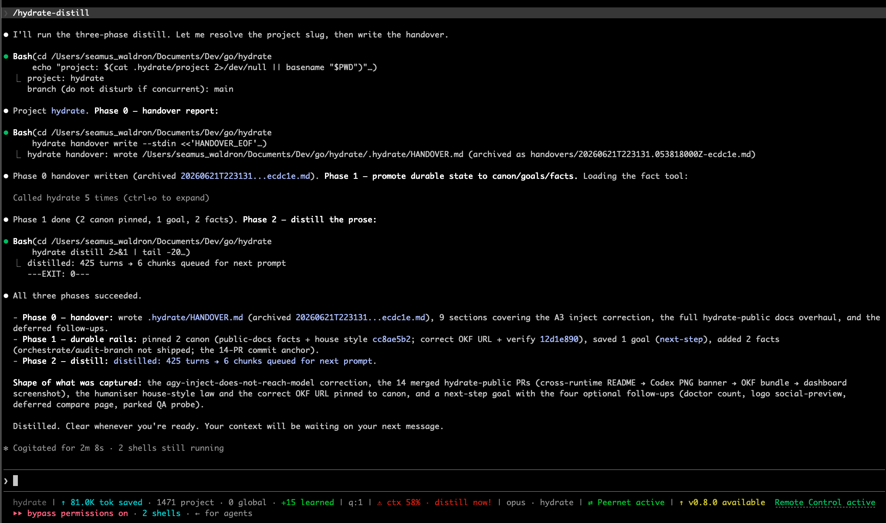
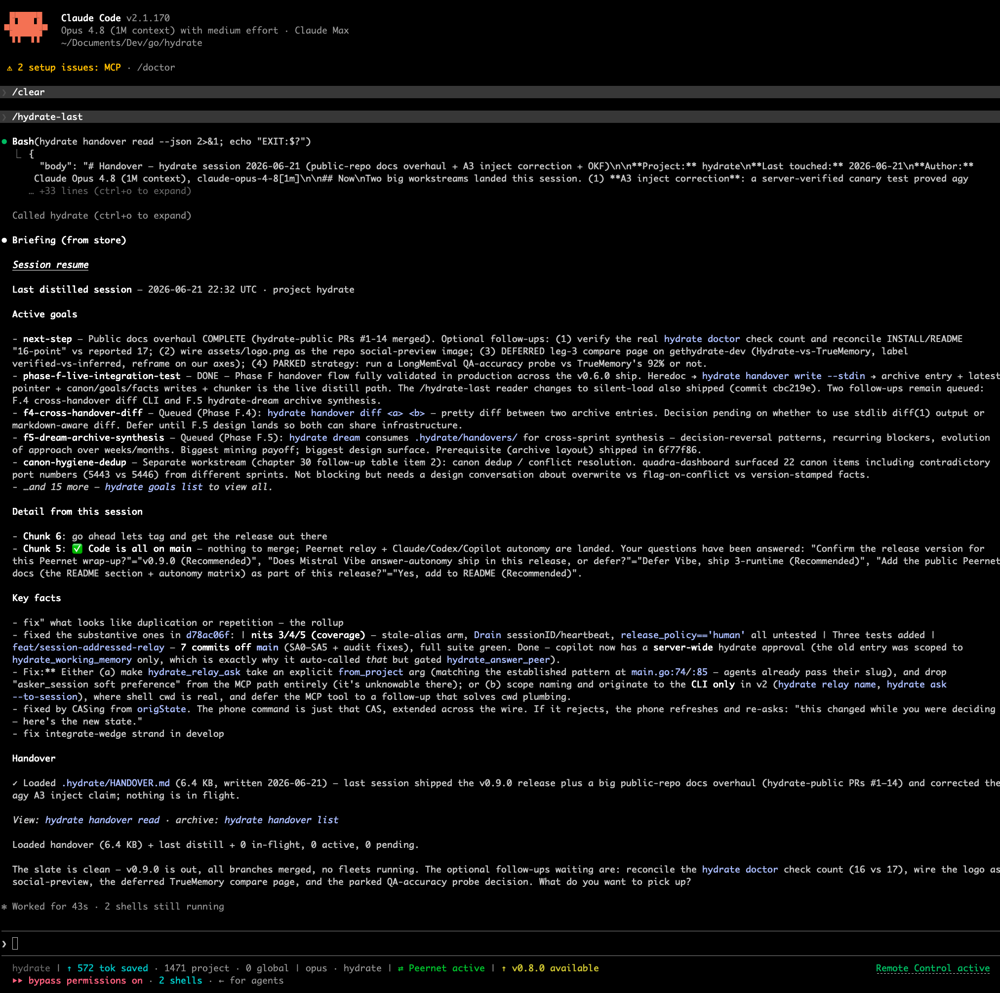

# Using Hydrate

Hydrate runs underneath your coding agent. Claude Code is the primary example,
with OpenAI Codex, Cursor, Antigravity, Mistral Vibe (fork), GitHub Copilot and
IBM Bob (in development) supported too. Every prompt you type is enriched with
relevant past context, and every session is captured when you stop. The slash
commands give you explicit control for the moments when you want to steer that.

Hydrate is a platform layer, not just a memory store. It covers memory,
adversarial multi-agent orchestration, token reduction and cross-agent
coordination over Peernet. Auto-recall injection works on Claude Code and Codex
(plus the Vibe fork); Cursor, Antigravity and Copilot run as capture plus MCP.

## Slash commands

The shipped set is exactly these ten. They run inside Claude Code. The rough
token cost of each is noted so you can reach for the cheap ones freely.

### `/hydrate` (about 600 tokens)

Base recall. Calls `hydrate_recall` to pull facts from memory matched against a
topic, then prints a short synthesis of what was loaded. Use it when you have
been deep in one conversation and want to check the relevant prior context is in
scope, or when starting a new topic mid-session.

```
/hydrate
/hydrate ingestion pipeline
```

### `/hydrate-last` (about 400 tokens)

Resume the most recent session. Run it immediately after `/clear` so the next
prompt has full orientation without you re-explaining anything. It runs in two
steps: first it reads the project's `.hydrate/HANDOVER.md` into context (the
high-fidelity note the previous session left), then it calls
`hydrate_session_resume` for a structured briefing (the last distilled summary
plus any in-flight or orchestration state). Scoped to the current project.

This is the headline product loop:

```
[long session]
/hydrate-distill        write a handover and capture before the context thins
/clear
/hydrate-last           back where you left off, for a few hundred tokens
```

### `/hydrate-project` (about 2,500 tokens)

Project audit. Calls `hydrate_canon_list` and `hydrate_facts_list` to load the
current project's canon (pinned authoritative facts) plus the top-ranked
semantic facts. Use it when joining or re-joining a project to see the agreed
conventions.

```
/hydrate-project
```

### `/hydrate-distill` (about 2,000 tokens)

Capture and compress the current session before `/clear`. The chunker
compresses prose well for narrative texture but loses crisp declarative state,
so distil does three things in order rather than relying on the summary alone:

1. It writes a **handover report** to `.hydrate/HANDOVER.md` (via `hydrate
   handover write`). This is the primary "what was I doing 90 seconds ago"
   channel: high-fidelity markdown that the resumed session reads directly, with
   no truncation.
2. It promotes durable state (decisions, goals, invariants) onto Hydrate's
   lossless rails: canon, goals and facts.
3. It distils the prose as the third layer.

The Stop hook already auto-captures every session, so this command is for the
moment you are about to `/clear` and want a tighter, higher-fidelity snapshot
than the automatic capture would produce.

```
/hydrate-distill
```

### `/hydrate-dream-recall` (about 1,500 tokens)

Pull the most recently consolidated context for the current project. Hydrate
runs a periodic "dream" cycle that summarises recent activity into themes and
flags contradictions across sessions; this surfaces the latest of it. (Formerly
`/hydrate-week`.)

```
/hydrate-dream-recall
```

### `/hydrate-timeline` (about 400 tokens)

Show the chronological story of the project's sessions, or of an entity across
them. Useful for "what happened with X" questions, where you want the sequence
rather than a topic match. Runs the `hydrate timeline` CLI.

```
/hydrate-timeline
```

### `/hydrate-dashboard` (about 80 tokens)

Open the local dashboard in your default browser. Runs `hydrate dashboard`,
which starts the daemon if it is not already up.

```
/hydrate-dashboard
```

### `/hydrate-peernet` (about 300 tokens)

Make this coding session discoverable to your other machines, so a session on
another box can ask it for live metadata over Peernet. Runs `hydrate peernet
activate` in the background. See the Peernet section of the README for the
network model and the per-runtime autonomy table.

```
/hydrate-peernet
```

### `/hydrate-pack-load` (about 500 tokens)

Load a hydration pack. Hydrate can export a project's memory as a single
`.hpack` file (canon plus semantic facts plus recent summaries) so it can be
shared between machines or teammates. This command loads one into the local
store and injects its contents as context for the session.

```
/hydrate-pack-load ~/Downloads/payments-platform.hpack
```

### `/hydrate-help`

Reference table of the commands above. No tool calls.

```
/hydrate-help
```

## The recovery loop: distil, clear, last

This is the most token-efficient way to start a fresh context window when the
current one is thin, and it is the core product flow:

```
/hydrate-distill        handover write, then canon/goal/fact promotion, then distil
/clear                  new context window
/hydrate-last           read the handover, then a structured resume briefing
```

Why it works: the handover report is high-fidelity markdown written for the next
session to read directly, and the durable state lives in canon, goals and facts,
so `/hydrate-last` reads a tight, accurate briefing rather than re-pasting the
conversation. The recall costs a few hundred tokens even after a multi-hour
session.

`/hydrate-distill` runs the three phases in order, handover then canon and goal
promotion then prose distil:

<div align="center">
  
</div>

After `/clear`, `/hydrate-last` reads the handover and the structured resume
briefing, surfacing the active goals and recent detail from the last session:

<div align="center">
  
</div>

## The handover CLI

`/hydrate-distill` drives the handover, but you can also work with it directly:

```sh
hydrate handover read           # print the current handover (--json for a wrapper)
hydrate handover write --stdin  # write a new entry from stdin (archived and set as latest)
hydrate handover path           # print the file path
hydrate handover list           # list archived entries (one per distil)
hydrate handover grep <pattern> # search across entries
hydrate handover prune --keep=N --older-than=DURATION
hydrate handover export --okf   # export in the open knowledge format
```

Files: `.hydrate/HANDOVER.md` is the latest entry (the one `/hydrate-last`
reads), and `.hydrate/handovers/*.md` is the archive, one per distil, kept for
mining.

## Sharing memory: packs

To share a project with a teammate, or with yourself on another machine, export
the canon and recent context as a `.hpack`:

```sh
hydrate pack create --project=payments --out=payments.hpack
```

Send the file. The recipient loads it with:

```sh
hydrate pack load payments.hpack
```

Or, inside Claude Code:

```
/hydrate-pack-load payments.hpack
```

Pinned canon facts always inject; semantic facts surface when relevant. A pack
is portable: it does not carry your local database, only the memory the
recipient should also have.

## First run in a project: auto-prime from CLAUDE.md

The first time your agent starts a session inside a project that already has a
`CLAUDE.md`, Hydrate runs `hydrate dehydrate` once in the background to extract
structured facts from it into the local store. From then on those facts surface
through `/hydrate` and `/hydrate-project` like any other memory, so the model no
longer has to re-read the file every turn.

The auto-prime runs once per project (a marker under `~/.hydrate/`; delete it to
retry), runs as a detached subprocess so it never blocks session start, and
reads `CLAUDE.md` only. It does not modify the file; rewriting is a separate,
opt-in CLI step (see below).

## Ingesting CLAUDE.md: hydrate dehydrate

The slash commands handle in-session memory. For the one-shot "compress my
existing CLAUDE.md and move the knowledge into Hydrate" pass, use the CLI:

```sh
hydrate dehydrate                          # dry-run preview
hydrate dehydrate --apply                  # mode=summary (default)
hydrate dehydrate --apply --mode=stub      # collapse to a short pointer
hydrate dehydrate --apply --mode=full      # extract facts only, leave the file untouched
hydrate dehydrate --revert                 # restore CLAUDE.md.pre-hydrate.bak
```

Modes:

- `summary` (default) rewrites `CLAUDE.md` to a compressed prose summary, with
  operational sections (build commands, hook config, setup steps) preserved
  verbatim. Still readable by people who do not use Hydrate.
- `stub` replaces the file with a short pointer plus the preserved operational
  content.
- `full` leaves `CLAUDE.md` on disk untouched; the facts still land in Hydrate.
  This is what the first-run auto-prime uses.

Safety: `--apply` always writes `CLAUDE.md.pre-hydrate.bak` before rewriting, and
the backup is never overwritten on later runs. `--revert` restores from it, and
re-running on unchanged input is a no-op.

## Memory across runtimes (MCP)

The same facts surface across every MCP-capable client. Capture them once in
Claude Code, then recall them in Codex, Cursor, Antigravity or Copilot through
the `hydrate_recall`, `hydrate_save_fact`, `hydrate_canon_add` and related tools
the MCP server exposes. See [`INSTALL.md`](INSTALL.md) for the per-tool wiring.

## Configuration

Sensible defaults work out of the box. Inspect or change persistent settings
with:

```sh
hydrate config path                    # print the config file location
hydrate config get <key>               # e.g. hydrate config get embed.dim
hydrate config set <key>=<value>       # e.g. hydrate config set server.port=49849
```

The keys cover the embedding and model settings (`embed.model`, `embed.dim`,
`embed.provider`, `embed.endpoint`, `llm.model`, `llm.provider`, `llm.endpoint`),
the server settings (`server.port`, `server.db_path`), and two opt-in beta guards
(`tool_capture.enabled`, `tool_guard.enabled`, `tool_guard.large_threshold_kb`).
API keys are not settable through this command, to keep them out of shell
history; edit `~/.hydrate/config.yaml` by hand for those.

How much context Hydrate injects per turn is controlled separately, by the
`HYDRATE_MODE` environment variable rather than a config key. It defaults to
`full`; set `HYDRATE_MODE=economy` to inject a leaner tier. The hook reads it on
every prompt, so no restart is needed.

```sh
export HYDRATE_MODE=economy   # add to your shell profile
```

## Status line and dashboard

When the daemon is running, the Claude Code status line shows how much context
Hydrate has injected for the session and the current context-window utilisation,
plus a Peernet indicator when Peernet is active.

The dashboard at `http://localhost:<port>/` (the port is in
`~/.hydrate/server.port`) has a home cockpit and per-pane drill-throughs for
sessions, facts, dreams, packs, MCP activity, retrievals, fatigue and
orchestration. Every pane pushes updates live over SSE, with no manual refresh.

## Troubleshooting

If a slash command does not return anything useful:

1. Run `hydrate doctor` to confirm the daemon, hooks and MCP wiring are healthy.
2. Run `hydrate server start` if the daemon is down.
3. Check the dashboard's MCP-activity pane. Every MCP call is logged with its
   tool name and response size, so a quiet pane means the command is not
   reaching the daemon.
4. File an issue at
   [/issues](https://github.com/getHydrate/hydrate-public/issues) with the
   output of `hydrate doctor --report`.
