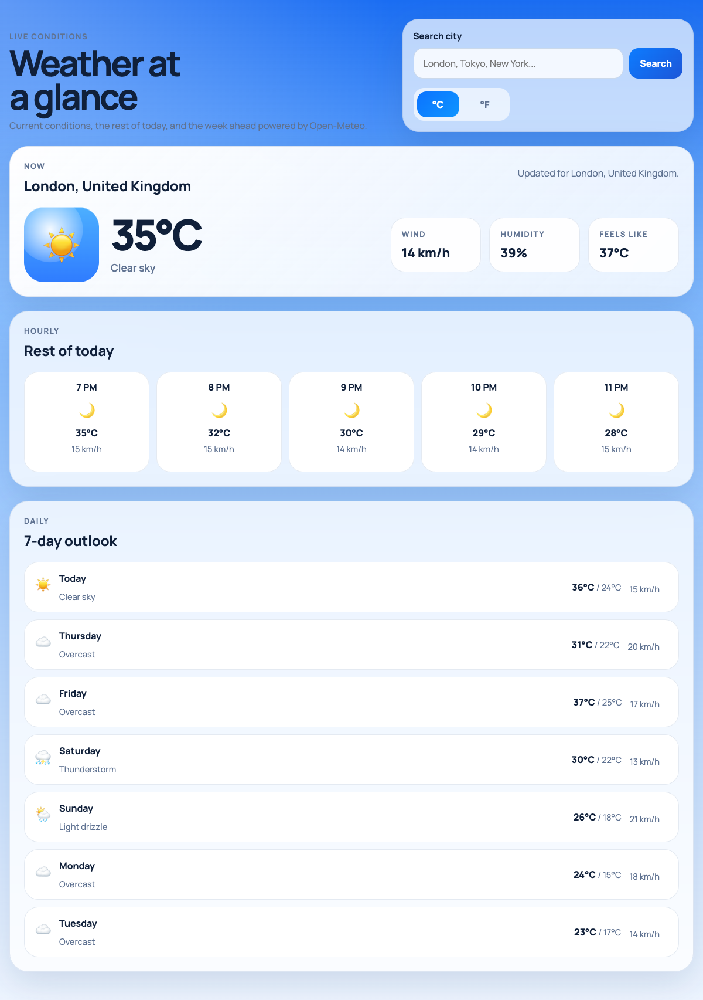
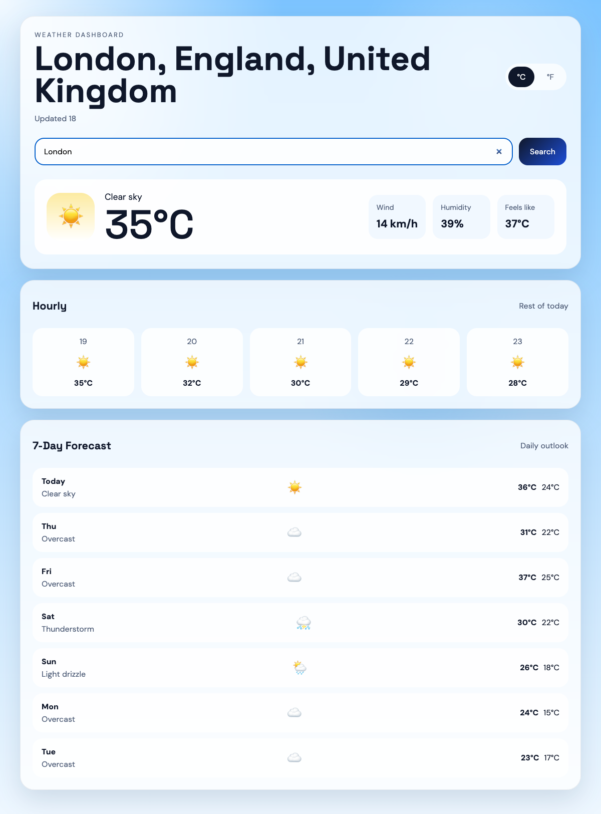

# Codex + Hydrate: what your Codex sessions gain when they remember

> **Status: Benchmark A measured (2026-06-24); Benchmark B pending.** The
> directive-portability result below is real — two live builds on Codex CLI
> 0.141 / gpt-5.4, both scored 12/12, screenshots included. The cross-runtime
> memory benchmark (B) is still marked `pending`; it wants the c8b harness, not
> a laptop run. We publish measured figures only.

[OpenAI Codex](https://developers.openai.com/codex) is one of the runtimes
Hydrate plugs into. This page does not pit Hydrate against Codex — Hydrate runs
*inside* Codex, as session-start and capture hooks plus an MCP server. The
question it answers is the only honest one:

> **What does a Codex session gain when Hydrate gives it a memory?**

Two things, measured two ways.

## The two benchmarks

| | What it proves | How |
|---|----------------|-----|
| **A. The directive ports** | The [`/hydrate-yagni`](../../slash-commands/README.md) concision lever works on Codex's own model, not just Claude | Same weather task, single shot, **with vs without** the directive — cost, LOC, 12/12 quality |
| **B. Only Hydrate gives Codex a memory** | Codex picks up where another runtime left off, and reuses what the last session built | Cross-runtime hand-off + cross-session reuse + compact-survival |

Benchmark A is the portable lever. Benchmark B is the part no single-vendor tool
can do, and it is where Codex gains the most.

## Benchmark A — does the YAGNI directive port to Codex?

Same task as [weather-bench](../../slash-commands/benchmarks/weather-bench/README.md), scored on the same
[12-point rubric](rubric.md). One fixed prompt, built with and without the
directive, on **Codex CLI 0.141.0 / gpt-5.4** (reasoning medium), single shots,
Hydrate hooks off so only the directive varies. Both arms scored **12/12**, so
the line-count and output-token gap is concision, not quality. Lower is better.

| Arm | Directive? | LOC | Files | Output tok | Score |
|-----|:----------:|----:|:-----:|----------:|:-----:|
| codex-vanilla | no | 809 | 3 | 10,545 | 12/12 |
| codex-yagni `/hydrate-yagni` | yes | **623** | 3 | **9,395** | 12/12 |

**The directive cut emitted code 809 → 623 LOC (−23%) and output tokens 10,545
→ 9,395 (−11%), at 12/12 parity.** On Claude Code the same directive cut a build
~78% in cost ([weather-bench](../../slash-commands/benchmarks/weather-bench/README.md)); on Codex/gpt-5.4 it
still lands a clean double-digit reduction, so the concision discipline ports.

**Why no dollar figure?** This Codex account runs on ChatGPT-subscription auth,
not an API key — there is no clean per-token cost to quote, so this page compares
on LOC and output tokens, not USD. (Input tokens were actually *higher* for the
yagni arm — 286k vs 224k — because the directive adds prompt and reasoning; the
win is in the code it emits, which is the line a reader ships and maintains.)

Both builds rendered live (Playwright); the only console error on each was the
benign favicon 404, same as weather-bench. One honest difference: the vanilla
arm shipped a geolocation-denial fallback to London, so it renders with no input;
the leaner yagni arm implements `getCurrentPosition` but no denial fallback, so a
no-geolocation context sits on "Detecting your location…" until a city is
searched. That is not a rubric miss — geolocation is implemented — but it is the
kind of robustness nicety a concision pass can trim, worth noting.

<table>
<tr>
<td width="50%"> <em>vanilla (no directive) — 809 LOC, geolocation→London fallback</em></td>
<td width="50%"> <em>yagni (<code>/hydrate-yagni</code>) — 623 LOC, rendered via city search</em></td>
</tr>
</table>

## Benchmark B — cross-runtime memory (the headline)

This is the Codex story. Hydrate's store is shared across runtimes, so a session
in one agent is visible to the next agent — even a different vendor's.

### B1. Cross-runtime hand-off

> **Start the weather feature in Claude Code → `/clear` → resume it in Codex.**
> Codex's session-start hook injects what Claude already did, and Codex continues
> the build without being re-briefed.

No single-vendor memory can tell this story, because it requires the two runtimes
to share one memory layer. The proven Claude↔Codex result on Hydrate's
cross-runtime compact-survival bench is a 1.00 / 0.90 recall pair; this page
re-runs it on current infra and shows the weather build crossing the boundary.

| Hand-off | Recall | Continued without re-brief? |
|----------|:------:|:---------------------------:|
| Claude Code → Codex | _pending_ | _pending_ |

A capture gate runs first: `hydrate resume --project=<slug>` must show the Claude
session before the Codex reader starts, so a slug-split false-empty can never be
misread as a real recall.

### B2. Compact-survival

Codex has no PreCompact event of its own — so for a long Codex session, Hydrate
*is* the compact memory. Build the app, force a context compaction, confirm the
build state survives and the session keeps its thread.

| Event | Survives compaction? |
|-------|:--------------------:|
| Codex session state | _pending_ |

### B3. Cross-session reuse

Two Codex sessions on the same project: session 1 builds, session 2 extends. A
no-memory arm rebuilds the component; a Hydrate arm reuses it. Higher reuse and
lower new-LOC is better.

| Arm | Memory? | Reuse rate | Avg new LOC |
|-----|:-------:|:----------:|:-----------:|
| codex-cold | no | _pending_ | _pending_ |
| codex-hydrate | yes | _pending_ | _pending_ |

## How to run this (for whoever fills the tables)

1. **Re-baseline on the latest Codex CLI** and its current default model. Do not
   reuse the Claude Opus weather-bench numbers; label the exact Codex version and
   model in `results/metrics.json`.
2. **Headless flag check.** Codex headless needs
   `--dangerously-bypass-hook-trust` plus the sandbox flags on 0.139+. The older
   0.130 invocation silently degrades to baseline — hooks never fire and the run
   looks like "Hydrate adds nothing". Verify the hooks actually fired before
   trusting any arm.
3. **Verify capture before recall.** Export `HYDRATE_PROJECT`, then gate every
   hand-off and reuse cell on `hydrate resume --project=<slug>` showing the
   writer's session first.
4. Score every build on the [rubric](rubric.md); a cost/LOC delta only counts at
   12/12 parity.

## Honest caveats

- **n=1.** Benchmark A is a single build per arm. The −23% / −11% are one clean
  pair, directionally consistent with weather-bench, not a distribution. Treat as
  indicative.
- **Different model from weather-bench.** Codex ran gpt-5.4; weather-bench ran
  Claude Opus. Cross-page comparisons are about the *uplift on each runtime*, not
  absolute size between runtimes.
- **No USD.** ChatGPT-subscription auth means no per-token dollar cost; this page
  reports LOC and output tokens instead.
- **Benchmark B not yet run.** The cross-runtime hand-off, compact-survival and
  reuse arms — the part that actually exercises Codex's gain from Hydrate — are
  still pending. Benchmark A is only the portability check.

## Files here

- [`prompt.txt`](prompt.txt): the verbatim task (identical to weather-bench).
- [`rubric.md`](rubric.md): the 12-point checklist.
- [`figure-codex-scoreboard.html`](figure-codex-scoreboard.html) / `.png`: the scoreboard (A measured, B pending).
- [`results/metrics.json`](results/metrics.json): full per-arm tokens, LOC and scores.
- [`results/vanilla-screenshot.png`](results/) / [`yagni-screenshot.png`](results/): the two live builds.
