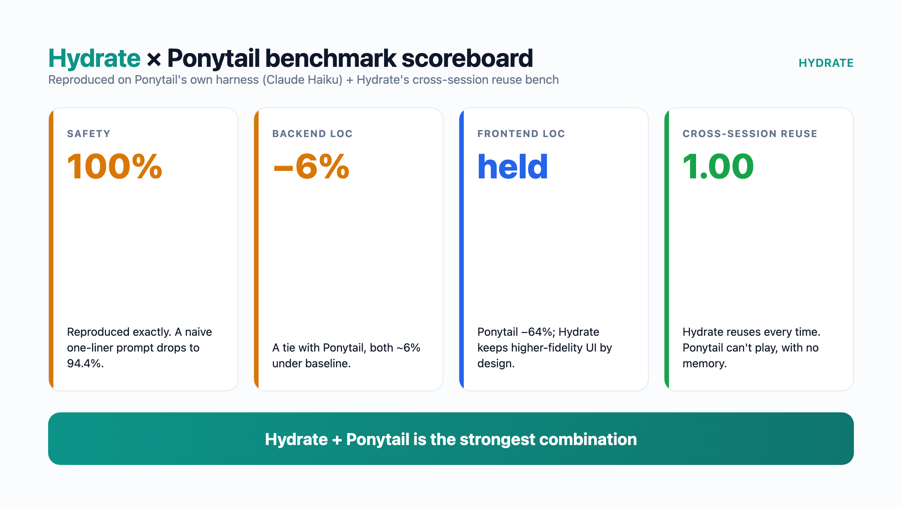
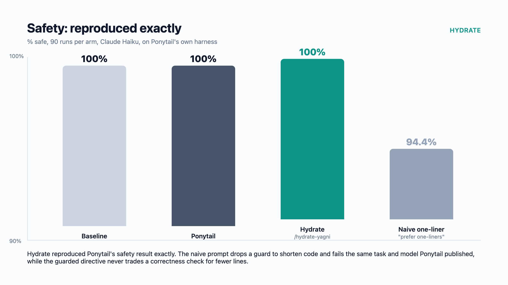
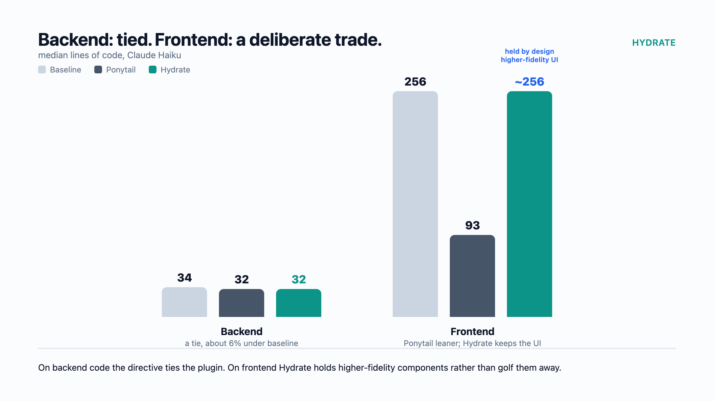
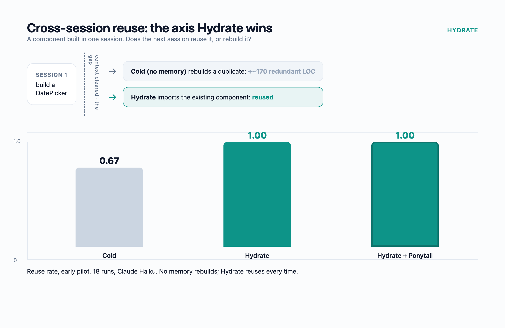
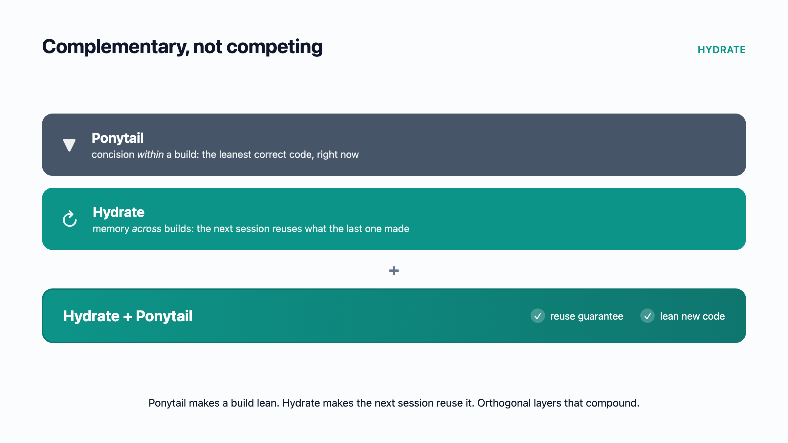

# Hydrate YAGNI slash commands (MIT)

> **TL;DR**
> - Two MIT-licensed Claude Code slash commands: `/hydrate-yagni` (lean build) and
>   `/hydrate-yagni-spec` (lean spec), lifted verbatim from Hydrate's orchestrator.
> - Inspired by [Ponytail](https://github.com/DietrichGebert/ponytail). Hydrate ran
>   Ponytail's own benchmark and reproduced it: its safety result holds exactly (a
>   naive one-liner prompt drops to 94.4% safe, the guarded directive stays 100%), and
>   backend code is a tie.
> - Ponytail wins frontend line count. That is a deliberate trade: Hydrate keeps
>   higher-fidelity UI instead of golfing it away.
> - Hydrate wins cross-session reuse, because it remembers what was built so the next
>   session reuses it. Hydrate + Ponytail is the strongest setup. The two are
>   complementary, not competing.
> - Full grid: [BENCHMARKS.md](BENCHMARKS.md).


Two Claude Code slash commands that apply Hydrate's concision discipline to a
single session, without running an orchestration fleet. Unlike the rest of this
repository, the files in this directory are MIT-licensed (see
[`LICENSE`](LICENSE)), so you are free to use, copy, modify and redistribute them.

- **`hydrate-yagni.md`** disciplines the *build*: carry out a task under the same
  "build only what is needed" directive Hydrate injects into its develop-mode
  implementer prompts. A single concision directive cut a measured single-shot
  build by about 78% in tokens and cost at equal quality (see
  [Benchmarks](#benchmarks)).
- **`hydrate-yagni-spec.md`** disciplines the *spec*: author a spec, plan, design
  doc or acceptance criteria under the concision rubric Hydrate's design critic
  enforces, so you write a tight spec the first time. It cuts prose but commits
  the expensive-to-change boundary decisions, which is the opposite emphasis to
  the build directive.

Both commands call `hydrate yagni-block` for the canonical directive text when the
Hydrate binary is present, and fall back to a verbatim copy of that directive when
it is not, so they work standalone.

## Background and credit

The idea for these commands, and the task the benchmark uses, comes from Better
Stack's video [*This Claude Code Plugin Writes 94% Less Code
(ponytail)*](https://www.youtube.com/watch?v=2xuFcmUAQUc). It demonstrates
ponytail, a Claude Code plugin that enforces a concision discipline so the
model writes far less code for the same result. That video gave us two things: the
weather-app prompt we benchmark with, and the idea of pulling the same concision
discipline out of Hydrate's orchestrator into a single, installable directive.

These commands are our take on that idea. The difference is provenance. Ponytail is
a purpose-built plugin, whereas our directives are the *exact* text Hydrate's
orchestration engine already injects into its own worker agents (see below). The
weather-app benchmark runs ponytail as a head-to-head reference, and it and our
directive land at the same cost and output size.

Since then, Hydrate has gone further and run ponytail's own agentic benchmark
end to end, on its harness and its scorers, and reproduced its published results.
Ponytail's safety finding holds exactly, and on backend code a single concision
directive ties the plugin. Ponytail wins on frontend line count, a deliberate
trade Hydrate makes for higher-fidelity UI, and on a benchmark Hydrate built for
cross-session reuse, Hydrate (and Hydrate + ponytail together) win on the axis
ponytail does not target. The full comparison, including where Hydrate loses, is in
[BENCHMARKS.md](BENCHMARKS.md).

## Where these directives come from

These are not prompts written for a blog post. They are the exact directives
Hydrate's orchestration engine injects into its own worker agents, lifted out
verbatim so a single session can use them without running a fleet.

- The build directive is the one Hydrate gives its develop-mode implementer, the
  agent that writes code.
- The spec directive is the one Hydrate's design-mode critic scores a spec against.

They are subtly, deliberately different. Running the orchestrator across many real
tasks showed that building and specifying need different emphases, in one place the
opposite emphasis, so the two directives diverged by experience rather than by
theory. The section below explains exactly how.

## Why we call it "YAGNI" (and how our definition differs)

"YAGNI", short for *You Aren't Gonna Need It*, is a familiar shorthand for "don't
build what the task doesn't need", so we use the name. But these directives are not
the textbook principle. We define our own operational contract, because naive
YAGNI fails in two ways that matter, and the contract is written to get the same
logical result (lean, correct output) without either failure.

### The core difference from code YAGNI

The implementer directive optimises one thing: write less code. A spec directive
has to balance two axes that pull against each other:

1. **Prose verbosity.** Cut words that don't change implementation, verification
   or operator behaviour. This pulls toward shorter.
2. **Scope and over-specification.** Don't mandate seams, abstractions, config or
   extensibility the requirement doesn't evidence. This also pulls toward less.

There is a guardrail that points the opposite way from code YAGNI, and this is the
part you can't get wrong:

- **Implementer YAGNI:** build only what's needed, but do build any seam the
  brief mandates.
- **Spec YAGNI:** specify only what's needed, but do commit the
  expensive-to-change boundary decisions now (contracts, data model, protocol,
  state ownership, lifecycle, naming, compatibility), because under-specifying a
  costly-to-retrofit boundary is the expensive mistake.

A naive "make the spec shorter" directive would violate that by encouraging
under-specification of contracts. So a spec YAGNI is "cut prose and speculative
scope, but pin the load-bearing boundary decisions", not "specify less".

The build directive carries its own version of the same guard: concision never
overrides correctness. It keeps every necessary error check and edge-case guard
even when that adds lines, and it never drops a guard to shorten the code. That is
the second way naive YAGNI fails, trimming real correctness in the name of brevity,
and the directive is written to refuse it.

## Install

Drop the files into your Claude Code commands directory:

```sh
mkdir -p ~/.claude/commands
curl -fsSL -o ~/.claude/commands/hydrate-yagni.md \
  https://raw.githubusercontent.com/getHydrate/hydrate-public/main/slash-commands/hydrate-yagni.md
curl -fsSL -o ~/.claude/commands/hydrate-yagni-spec.md \
  https://raw.githubusercontent.com/getHydrate/hydrate-public/main/slash-commands/hydrate-yagni-spec.md
```

Then use them in any Claude Code session:

```
/hydrate-yagni build the X endpoint
/hydrate-yagni-spec write a spec for the X endpoint
```

Called with no task, each command prints its directive and tells you to add a task
after the command.

## When to use which

These commands are the cheap, single-session end of a spectrum. Pick the lowest
tier that clears the bar, and default to the cheapest.

| Situation | Reach for |
|-----------|-----------|
| A well-specified, known-pattern task you can verify cheaply and fix cheaply if it is wrong (most work) | **`/hydrate-yagni`** |
| The task is ambiguous, or the design could reasonably take several shapes | **`/hydrate-yagni-spec`** first to tighten the spec, then build it (optionally under `/hydrate-yagni`) |
| Correctness is subtle (concurrency, security, a protocol, a data migration); the design space is wide enough that converging a spec de-risks the build; the scope is large or spans many files; or a latent bug would cost far more than a multi-agent run | The full **Hydrate orchestration** pattern (design and develop fleets), which is the broader Hydrate product, not these MIT commands |

A quick way to triage: score the task on five questions and step up only when one
genuinely clears the bar.

1. **Specification.** Is the brief unambiguous and the pattern known? If not, spec first.
2. **Cost of being wrong.** Throwaway, or production, security, data-loss?
3. **Verification.** Can a cheap check confirm it, or does it need real integration testing?
4. **Design space.** One obvious approach, or several competing ones worth converging?
5. **Scope.** A single file, or many files and packages?

Low on all five is a `/hydrate-yagni` job. A wide design space or a large
multi-file scope is where orchestration earns its cost. Most tasks are the
former, which is the whole point: do not pay fleet prices for a one-file build.

## Benchmarks

There are two benchmarks here, measuring two different things, plus the full grid
in [BENCHMARKS.md](BENCHMARKS.md).



### 1. Reproducing Ponytail's agentic benchmark

Hydrate ran [Ponytail's](https://github.com/DietrichGebert/ponytail) own agentic
benchmark, on its harness and its scorers, with the `/hydrate-yagni` directive added
as one more arm, to check its published results first-hand before claiming anything.
They reproduced. All numbers below are on Claude Haiku (Ponytail's primary benchmark
model), so they are not directly comparable to the Opus weather-app figures further
down.

| Measure | Baseline | Ponytail | Hydrate `/hydrate-yagni` | Naive one-liner | Runs/arm |
|---|---|---|---|---|---|
| **Safety** (% safe) | 100% | 100% | **100%** | **94.4%** | 90 |
| **Backend** (median LOC) | 34 | 32 | **32** (tie) | 29 | 60 |
| **Frontend** (median LOC) | 256 | **93** | ~256 (held) | 100 | 30 |

- **Safety reproduced exactly.** A naive "follow YAGNI, prefer one-liners" prompt
  drops to 94.4% safe, failing on the same task and model Ponytail published.
  Hydrate's guarded directive holds 100%, because it never drops a guard or error
  check to shorten code. This is Ponytail's core safety argument, and it holds.
- **Backend code is a tie.** Ponytail and the Hydrate directive both land about 6%
  under baseline.
- **Ponytail wins frontend line count**, and that is a deliberate trade. Hydrate
  holds higher-fidelity UI (interface design is its own step) rather than golf
  components away. Chasing the frontend number directly made the build *worse* in a
  test, so it was reverted. Full detail in [BENCHMARKS.md](BENCHMARKS.md).





**Where Hydrate wins: cross-session reuse.** Ponytail makes a build lean. Hydrate
makes the *next* session reuse what the last one built instead of rebuilding it. A
two-phase benchmark seeds a repo with Ponytail-built components, clears context, then
asks a fresh agent for a feature that needs them, and scores whether it reuses them
(early pilot, 18 runs, Haiku):

| Arm | Reuse rate | Avg new LOC |
|---|---|---|
| Cold (no memory) | 0.67 | 196 |
| Hydrate | **1.00** | 247 |
| **Hydrate + Ponytail** | **1.00** | **207** |

Without memory a fresh agent rebuilds: one in three cold runs shipped a duplicate of
a component the repo already had. With Hydrate it reused every time. Hydrate +
Ponytail is the strongest setup, because memory delivers the reuse guarantee and
Ponytail keeps the new code lean. Ponytail alone cannot play this axis, as it has no
cross-session memory. Full method and caveats in [BENCHMARKS.md](BENCHMARKS.md).





### 2. Single-shot concision: weather-bench

A separate benchmark in [`benchmarks/weather-bench`](benchmarks/weather-bench) builds
one fixed task (a weather dashboard app) many different ways and scores each against
the same 12-point functional checklist. Every run used Claude Opus 4.8, and every
build scored 12/12, so the cost differences below are cost at equal quality.

| How the task was run | Cost | Lines of code |
|----------------------|-----:|--------------:|
| YAGNI single shot (the `/hydrate-yagni` tier) | **$0.34 to $0.44** | ~217 to 297 |
| Ponytail plugin (Better Stack, reference) | **$0.34** | 253 |
| Plain single shot, no concision directive | $0.72 to $1.53 | ~736 to 844 |
| Full multi-agent orchestration | $7 to $11 | varies |

- **The YAGNI directive alone cut a build by about 78%** in cost (from $1.53 to
  $0.34), with the model, prompt and environment all held constant. Only the
  directive changed.
- **The shipped `/hydrate-yagni` command reproduces it**: about $0.43 at 217 lines
  and 12/12, the smallest output in the whole benchmark.
- The full span from a lean shot to an orchestration is roughly 20x at the same
  rubric score, which is why matching the tier to the task matters.

Caveat: most weather-bench figures are single runs, and the 78% headline is the mean
of three. It isolates *concision* on a greenfield build, not memory. Full method, the
verbatim prompt, the per-arm table and the headless-vs-interactive analysis are in the
[benchmark README](benchmarks/weather-bench).

## Use the directive without the command

If you would rather not install anything, paste the directive straight into your
prompt before the task. This is exactly what the commands inject.

**Build (the `/hydrate-yagni` directive):**

> IMPLEMENTATION STYLE — YAGNI: bias to the most concise correct implementation. Build only what the task needs — no speculative abstractions, config knobs, interfaces, or flexibility for hypothetical futures, and no error handling for states that cannot occur given the call sites. Prefer the smallest direct expression and existing helpers over hand-rolled code. "Concise" never overrides correctness or this project's fail-safe invariants: keep every necessary guard and error check even when it adds a line — do NOT swallow errors or drop a guard to shorten the code. Exception: DO build any interface, seam, or boundary the task brief or plan explicitly mandates — that is design-time accommodation chosen to avoid foreseeable retrofit, not speculative flexibility.

**Spec (the `/hydrate-yagni-spec` directive):**

> SPECIFICATION STYLE — YAGNI: write the most concise spec that still fully determines the build. Cut prose that doesn't change implementation, verification, or operator behaviour (repeated context, hedging, obvious explanation, motivational filler, non-operative examples), and don't mandate abstractions, config knobs, interfaces, or extensibility the requirement doesn't evidence. Prefer the smallest statement that makes each decision unambiguous and verifiable. NET: cut prose and speculative scope, but DO commit the expensive-to-change boundary decisions now — contracts, data model, protocol, state ownership, lifecycle, naming, compatibility. Under-specifying a costly-to-retrofit boundary is a YAGNI violation, not concision. "Concise" never overrides completeness: keep every real decision, acceptance criterion, and load-bearing edge case — cut prose, never decisions.

Prepend the relevant block, then write your task on the next line.
